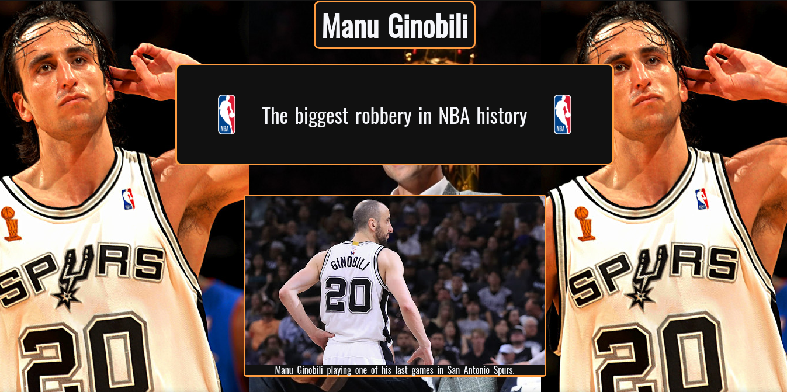

# fcc-project-1
## Proyecto #1 - Responsive Web Design: Construye una página tributo.

### FreeCodeCamp - Responsive Web Design / Project #1: Build a Tribute Page:

https://tobiasfacello-fcc-project-1.netlify.app/

<h3 align="center"> Lenguajes utilizados: </h3>

  
  

CodePen (Solution link): https://codepen.io/tobiasfacello/pen/dypVqdj
